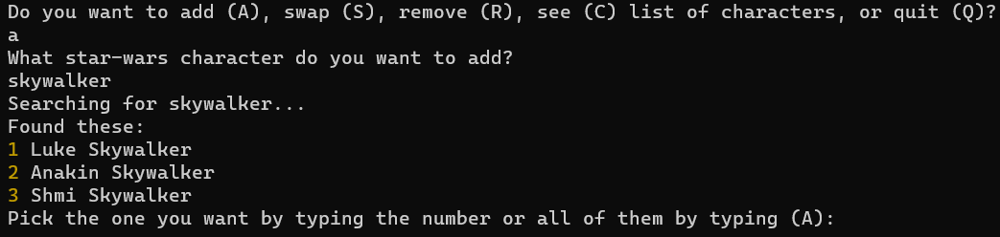
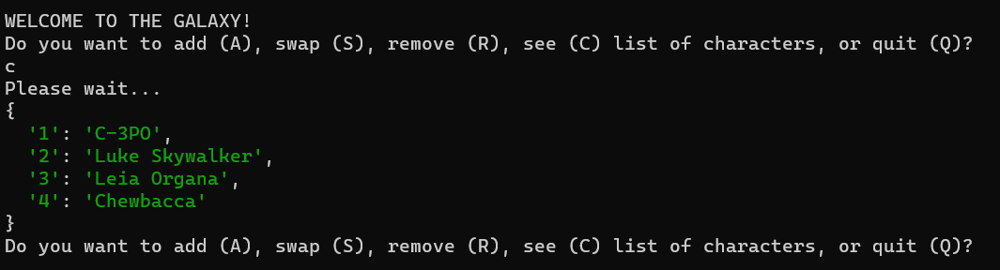

# Project Overview
## SWAPI Star Wars Character Ranking App
### Description: 
Entering into the Star Wars Universe you now have the abillity to search for and select any character you want from the SWAPI-api and rank them, all by your liking. You can add, reorder and remove the characters however you want. 
## Installation and Setup
### Requirements:
Requires no dependencies.

### Installation: 
Make sure you have the following software installed:

- [Node.js](https://nodejs.org/)
- [Git](https://git-scm.com/)

In your console, clone the repository by writing:
```bash
git clone https://github.com/BenyoMano/node-starwars-api-MongoDB.git
```
When finished, start the app by:
````bash
cd node-starwars-api-MongoDB && node app.js
````
## Project Features
### List of Features: 
Enumerate the main features of your project with a brief description of each.
1. Add any, one or several characters to your ranked list.
2. Swap them to rearrange the order.
3. Remove one or all characters.
4. Watch and enjoy your ranked list of characters.
### Usage Examples:




## Technologies Used
**Server:** Node.js v20.2.5

**Database:** MySQL