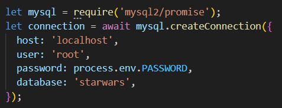
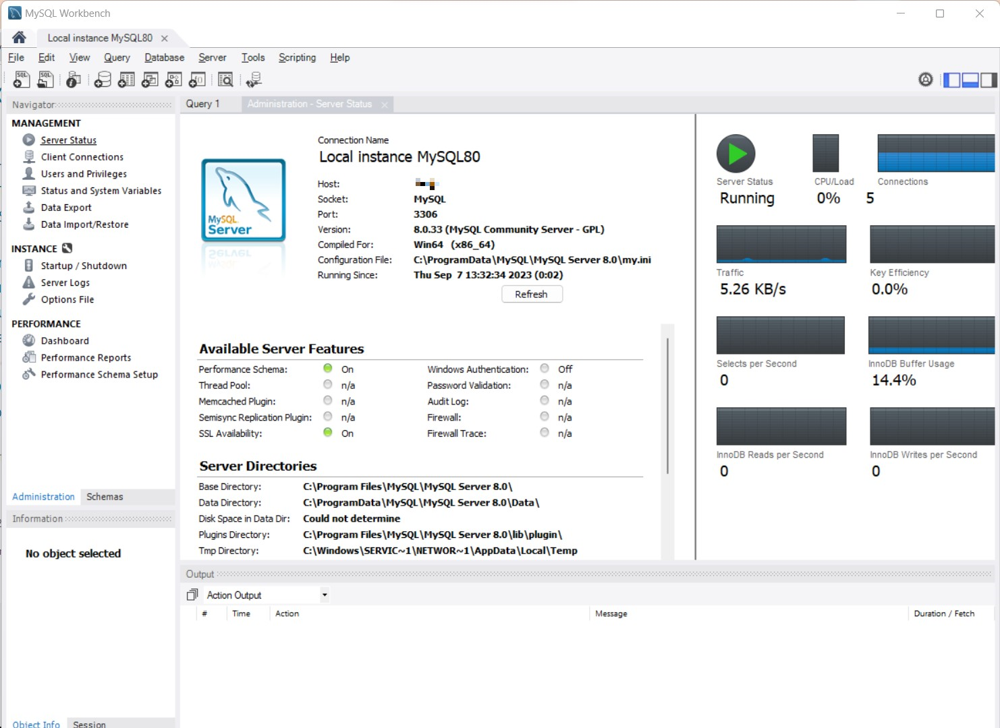
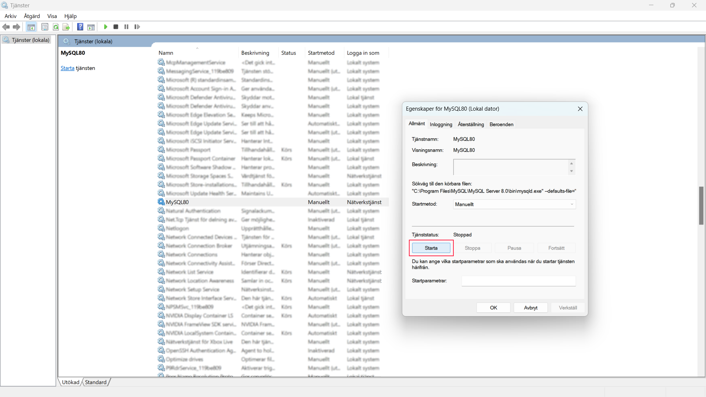
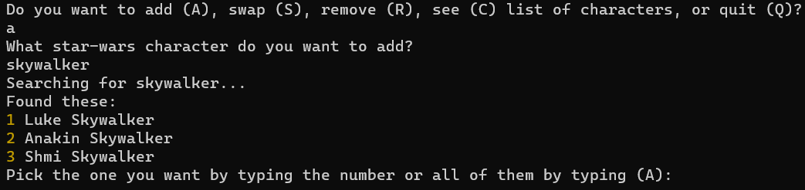
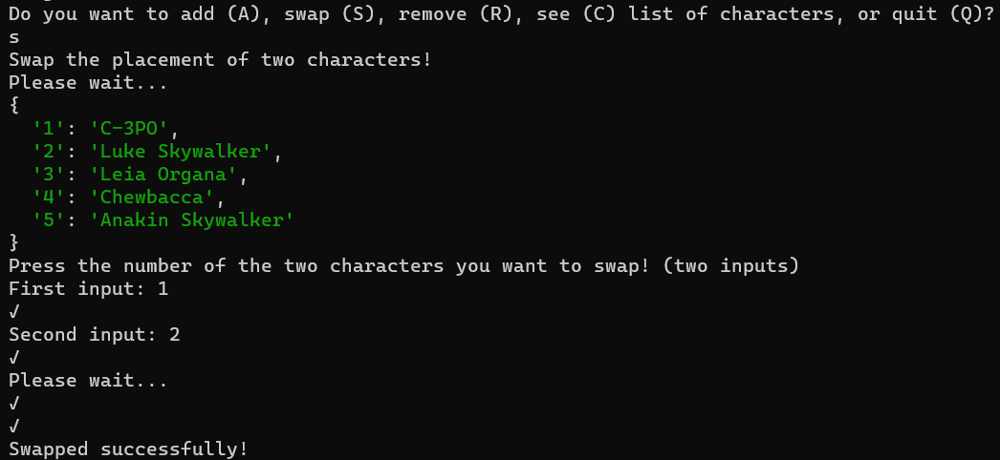
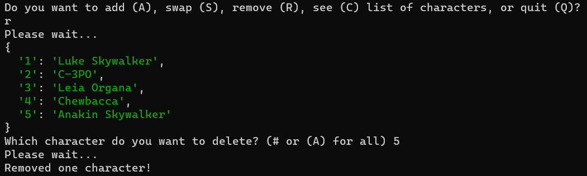

# SWAPI Star Wars Character Ranking App
## Table of contents
- [Description](#Description)
- [Installation and Setup](#installation-and-setup)
- [Project Features](#project-features)
- [Techonolgies Used](#technologies-used)
## Description: 
Entering into the Star Wars Universe you now have the abillity to search for and select any character you want from the SWAPI-api and rank them, all by your liking. You can add, reorder and remove the characters however you want. 
## Installation and Setup

### Installation: 
Make sure you have the following software installed:

- [Node.js](https://nodejs.org/) (version 18 or higher)
- [Git](https://git-scm.com/)
- [MySQL](https://dev.mysql.com/downloads/) (To run the server locally)
<details>
<summary>More on MySQL setup</summary>
<h3>Tip</h3>
<p>Make sure you have your database configured correctly with its details matching the project's, accordingly:</p>

<p>All <i>five</i> database-associated files are denoted <b>MySql***</b></p>
<p>Verify your server is running either through <b>MySQL Workbench,</b></p>

<br>
<br>
<p>or by opening Windows services and starting <i>MySQL80</i> manually.</p>

</details>

### Run locally in your console:
Clone the repository
```bash
git clone https://github.com/BenyoMano/node-starwars-api-MySQL.git
```
Enter the project directory
````bash
cd node-starwars-api-MySQL
````
Install dependencies
````bash
npm install
````
Start the app
````bash
node app.js
````
## Project Features
### Features: 
- Add any, one or several characters to your ranked list.
- Swap them to rearrange the order.
- Remove one or all characters.
- Watch and enjoy your ranked list of characters.
### Examples:




## Technologies Used
**Server:** Node.js v20.2.5

**Database:** MySQL